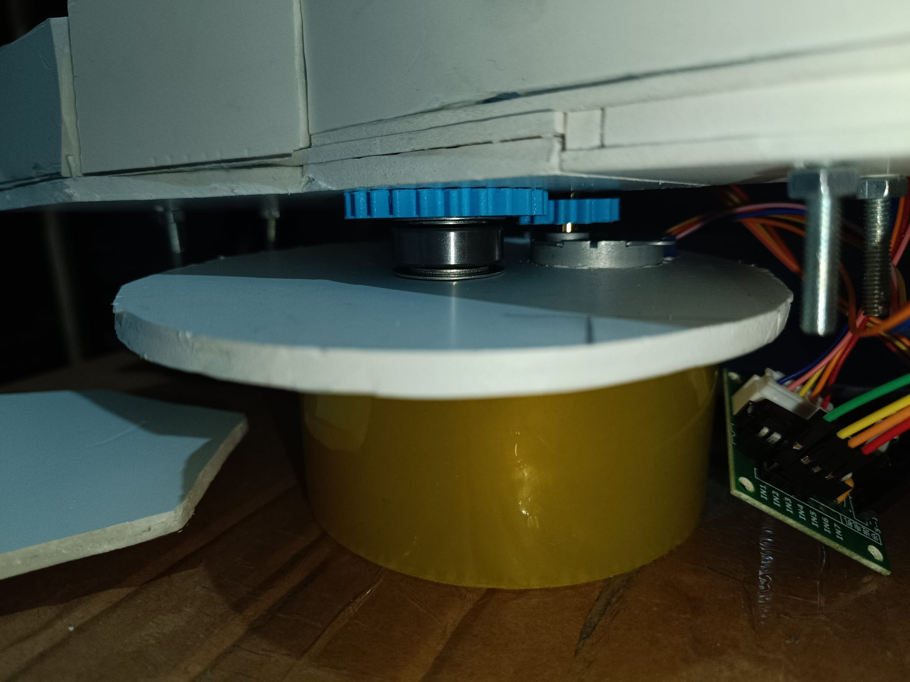
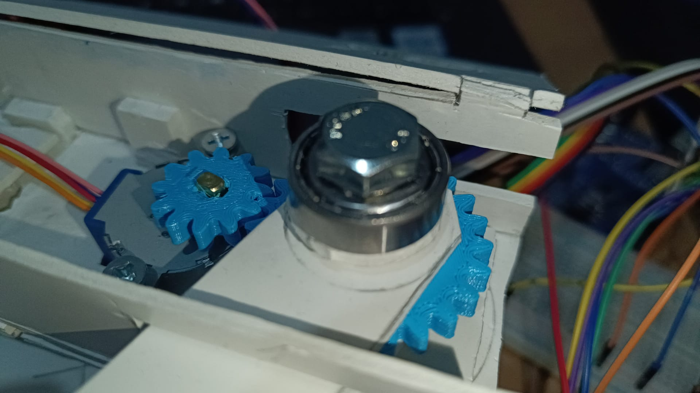

# SCARA

# 28 BYJ-48 step motorları kullanılarak yapılan el yapımı SCARA prototipidir.(WIP)

> **Durum:** 🟡 Geliştirme Aşamasında (Work in Progress)
> **Kategori:** Robotik / Mekanik Tasarım

Bu proje, endüstriyel SCARA (Selective Compliance Assembly Robot Arm) robotlarının çalışma prensiplerini analiz etmek ve düşük maliyetli bir prototip geliştirmek amacıyla başlatılmıştır. Proje, özellikle **güç aktarım mekanizmaları** ve **kinematik analiz** üzerine yoğunlaşmaktadır.

---

## ⚙️ Mekanik Tasarım Detayları

Robotun mekanik gövdesi, hassasiyet ve dayanıklılık gözetilerek tasarlanmıştır. Güç aktarımı için özel dişli profilleri ve sürtünmeyi minimize etmek için rulmanlı yataklama sistemleri kullanılmıştır.

### 1. Dişli Kutusu ve Aktarım Sistemi (Gearbox Design)

Motor torkunu artırmak ve hassas açısal hareket sağlamak için **Spur (Düz) Dişli** sistemi tercih edilmiştir.

<table>
  <tr>
    <td width="40%">
      
    </td>
    <td width="60%">
      <h3>Teknik Özellikler</h3>
      <ul>
        <li><b>Dişli Tipi:</b> Spur (Düz) Dişli</li>
        <li><b>Motor:</b> 28BYJ-48 Step Motor</li>
        <li><b>Malzeme:</b> PLA+</li>
      </ul>
      

        Dişliler arasındaki boşluğu (backlash) minimize etmek amacıyla diş profilleri optimize edilmiştir. 
        Fotoğrafta görülen ana tahrik dişlisi, motor milinden aldığı gücü doğrudan ikinci eklemi hareket ettiren kola iletir.
      

    </td>
  </tr>
</table>

### 2. Rulman ve Yataklama (Bearing Implementation)

Eklemlerdeki sürtünmeyi azaltmak ve eksenel yükleri karşılamak için yazıcı rulmanları kullanılmıştır.

<table>
  <tr>
    <td width="60%">
      <h3>Yataklama Stratejisi</h3>
      

        Robotun ana eksenlerinde <b>[Rulman Modeli: 608zz]</b> serisi rulmanlar kullanılmıştır.
      

      <ul>
        <li><b>Stabilite:</b> Eklemlerin yalpalamasını (wobble) engellemek için çift rulmanlı yataklama yapılmıştır.</li>
      </ul>
    </td>
    <td width="40%">
      
    </td>
  </tr>
</table>

---

## 🛠️ Kullanılan Donanımlar
* **Motorlar:** [28 BYJ-48]
* **Sürücüler:** [ULN2003]
* **Kontrolcü:** [Arduino UNO]

## 🚀 Gelecek Hedefleri
- [ ] Ters kinematik (Inverse Kinematics) kodunun tamamlanması.
- [ ] Uç işleyici (Gripper) tasarımı.
- [ ] Gövde parçalarının kaplaması ve merkez kolonun tamamlanması.
